# 4 Tech Desafio Técnico — (Backend Júnior)
--- ---
## Visão Geral
> Foi realizado o teste de Cadastro de Beneficiarios seguindo os princípios do SOLID, 
> para esse projeto foi utilizando a Clean Architetura com intuito de isolar o Domínio 
> e as Regras de Négocios do framework.

---
## Stack Utilizada

- **.NET 9** - Para ser o framework principal
- **ASP .NET Core** - API 
- **PostgreSQL** - Banco de Dados
- **Entity Framework Core** - ORM
- **Docker** - Deploy / Contâiner

---
## Padrões Utilizados

- **Repository Pattern** - Para operações CRUD abstraídas
- **Clean Architecture** - Arquitetura com domínio isolado

---
## Decisões Técnicas

- **GlobalExceptionHandler**: Tratamento de exceções personalizadas 
- **Hard Delete**: Os dados serão removidos do banco, sem ter o acesso novamente 
- **Scalar**: Diferente do Swagger, tem uma visão mais robusta para listagem e testes de endpoints.

---
## Estrutura do Projeto
```
docs/
├── c4-container.svg  # 2 camada do C4-model 

src/
├── Api/              # Web API com os Controllers
├── Application/      # Casos de uso para cada funcionalidade (UseCases)
├── Domain/           # Entidades
└── Infrastructure/   # Acesso e Repositórios de dados

tests/
├── Health.Application.Tests/  # Testes unitários para os UseCases - ( Casos de Uso )
```
---
## Diagrama de Arquitetura

---

## Registro de Decisões (ADR - Architectural Decision Records)

### Para a decisão de pastas
> Foi utilizada o padrão da Clean Architecture, seguindo a divisão entre 
> **Domain**, **Application**, **Infraestructure** e **Api**.

- **Domain** - Entidades, Exceções, Enums, Interfaces e Validadores. ( Código Puro - Isolado)
- **Application** - Casos de Usos, Abstrações, DTO - (Data Transfer Object) e Mapeadores. ( Funcionalidades Dividas - Responsabilidades Únicas)
- **Infrastructure** - Injeção de Dependências, Migrações, Persistências e Repositórios (Implementações Concretas - Conexão Externa )
- **Api** - Controladores, Exceção e Propriedades - (Camada de Transferência e Criação de Dados - Externo)
---

### Para manter a integridade entre Beneficiario e Plano
> A nível de implementação foi decidido que apenas possuindo um plano existente, já salvo no
> banco de dados, poderá ser vinculado a um Beneficiario, caso não tenha, existe uma validação.

---
### Análise de Trade-offs
>Em um cenário que a aplicação deve suportar 1 milhão de beneficiarios, seria o tempo de respostas das requisições
>pensando nisso o uso ideal seria implementar um Redis para realizar o cache, pois quando acessada pela primeira vez, 
>terá uma resposta bem mais rápida na próxima vez, pelo fato de armazenar os dados em um chave única (Key-Value).  
---

## Executando os Testes

- Para a execução de todos os testes unitários dos Casos de Usos. 
Abaixo está o comando: 
```bash
dotnet test
```
---

## Desafio Teórico
**Pergunta de Design:**
Imagine que, após a criação de um beneficiário, o sistema precise:

1.  Enviar um e-mail de boas-vindas.
2.  Notificar um sistema externo de Auditoria Governamental.

>Para essa implementação, deve ser atualizado a Entidade de Beneficiário com o campo Email
>e também adicionar um Serviço orientado a Eventos, ou seja, assim que finalizar o cadastro
>publicar esse evento de envio de email, que independente da resposta não irá afetar na criação
>do Beneficiário.

---
## Como rodar - ( Local )

- **Necessário** ter o SDK do dotnet instalado na sua máquina na versão **9.0** !
- Também ter uma instância do Postgres, podendo ser em um Docker ou rodando localmente. Aqui abaixo está o comando para rodar com o Docker.

1. Subir um banco postgres
````bash
docker run -d \
  --name postgres-db \
  -e POSTGRES_USER=postgres \
  -e POSTGRES_PASSWORD=postgres \
  -e POSTGRES_DB=4tech-desafio \
  -p 5432:5432 \
  postgres:16
````

2. Execute a aplicação:

```bash
dotnet run --project src/Api
```

Estará disponível na url -> `http://localhost:5207`

## Como rodar - ( Docker )

- **Necessário** ter o Docker e Docker Compose instalado na sua máquina!
- Apenas executar os seguintes comandos, um para o build da imagem e outro para subir a aplicação:

```bash
docker compose up -d
```

Estará disponível na url -> `http://localhost:8080`

## Documentação da API
Foi utilizado o scalar para documentação da API, por ter uma interface mais completa e robusta.
Acesse em:
- Local: `http://localhost:5207/scalar/v1`
- Docker: `http://localhost:8080/scalar/v1`

---

## Endpoints da API

### Beneficiários

- `POST /api/beneficiaries` - Criar um novo beneficiário
- `PUT /api/beneficiaries/{id}` - Atualizar beneficiário existente
- `DELETE /api/beneficiaries/{id}` - Deletar beneficiário
- `GET /api/beneficiaries/{id}` - Buscar beneficiário por ID
- `GET /api/beneficiaries` - Listar todos os beneficiários 

### Planos

- `POST /api/plans` - Criar um novo plano de saúde
- `PUT /api/plans/{id}` - Atualizar plano de saúde existente
- `DELETE /api/plans/{id}` - Deletar plano de saúde
- `GET /api/plans/{id}` - Buscar plano de saúde por ID
- `GET /api/plans` - Listar todos os planos cadastrados

### Health Check

- `GET /` - Retorna o status da aplicação e da conexão com o banco

